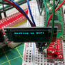

# picow-projects

Projects for Raspberry Pi Pico W

## [bme280](bme280)

A sensor node proof-of-concept for Pico W in MicroPython.

## [grow_monitor](grow_monitor)

The bme280 code extended to include a 1-Wire DS18B20 temperature probe.

